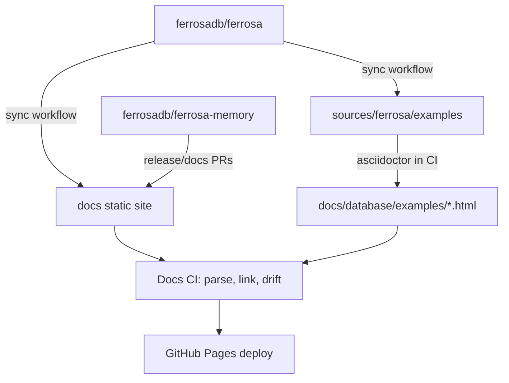

# Docs Repository Migration

> Last updated: 2026-06-05
> Status: Staging live

## Overview

Ferrosa's public website used to live inside the Ferrosa engine repository under
`docs/`. That coupled website updates to storage, CQL, cluster, and release CI.
The standalone docs repository owns the deployable static site and docs-only CI,
so documentation can ship without waiting for unrelated engine tests. It is
currently live at `https://ferrosadb.github.io/ferrosa-docs/`; production domain
cutover is tracked separately because `www.ferrosadb.com` is still configured on
the legacy `ferrosadb/ferrosa` Pages site.

The repository still preserves generated example documentation. The checked-in
`sources/ferrosa/examples/**/*.adoc` tree mirrors Ferrosa examples and CI
regenerates `docs/database/examples/*.html` from that source on every PR.

## Diagram

## Components

### Static Site

- **Purpose**: Published website and installer files.
- **Location**: `docs/`
- **Key files**: `CNAME`, `LATEST`, `setup.sh`, `setup-memory.sh`, product docs.

### Ferrosa Example Sources

- **Purpose**: Keep generated database example HTML reproducible.
- **Location**: `sources/ferrosa/examples/`
- **Source of truth**: Mirrored from `ferrosadb/ferrosa/examples`.

### Generation Script

- **Purpose**: Convert AsciiDoc examples into checked-in HTML.
- **Location**: `scripts/generate-example-docs.sh`
- **Dependency**: Asciidoctor `2.0.20`.

### Sync Workflow

- **Purpose**: Pull docs and examples from a Ferrosa ref and open a docs PR.
- **Location**: `.github/workflows/sync-ferrosa.yml`

## Key Decisions

- **Docs deploy from this repo only**: GitHub Pages publishes `docs/` here.
- **Generated HTML remains checked in**: The website stays static and simple.
- **AsciiDoc remains in CI**: Drift between `sources/ferrosa/examples` and
  generated HTML fails docs CI.
- **Product repos do not block docs deploy**: Ferrosa and Ferrosa Memory can
  still contribute docs changes through PRs or sync workflows, but their engine
  CI is not required to deploy website copy.

## Open Questions

- [ ] Should production cutover happen immediately after the Ferrosa 0.13
      release, or after one staging deploy cycle?
- [ ] Should Ferrosa release workflows dispatch `sync-ferrosa.yml` automatically
      after tag builds complete?
- [ ] Should Ferrosa Memory get a matching sync workflow if it grows first-class
      website source files outside this repo?
- [ ] Should `docs/LATEST` updates be gated by checking that both Ferrosa and
      Ferrosa Memory release assets exist?
